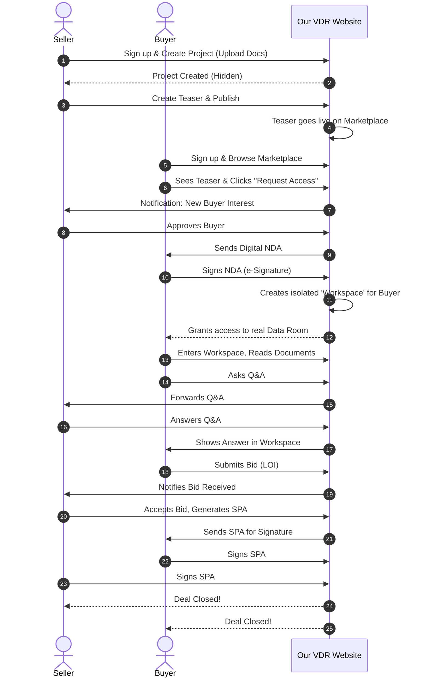

# End-to-End User Journey: M&A Platform (Website Flow)

இந்த ஆவணம், நமது M&A இணையதளத்தில் (Website) ஒரு Seller மற்றும் Buyer எப்படி Sign up செய்து, என்னென்ன ஸ்கிரீன்களைப் (Screens) பயன்படுத்தி ஒரு Deal-ஐ வெற்றிகரமாக முடிக்கிறார்கள் என்பதை படிப்படியாக (Step-by-step) விளக்குகிறது.

---

## 1. The Seller's Journey (விற்பனையாளரின் பயணம்)

Seller (அல்லது Investment Banker) தனது கம்பெனியை விற்க இணையதளத்திற்கு வருகிறார்.

*   **Step 1: Sign Up & Onboarding**
    *   Seller நமது இணையதளத்திற்கு வந்து "Sell Your Business" அல்லது "List a Deal" பட்டனை கிளிக் செய்கிறார்.
    *   தன் பெயர், கம்பெனி ஈமெயில் கொடுத்து Sign Up செய்கிறார்.
*   **Step 2: Dashboard & Create Project (டேஷ்போர்டு)**
    *   உள்ளே வந்ததும் அவருக்கான Seller Dashboard திறக்கும்.
    *   "Create New Project" பட்டனை கிளிக் செய்கிறார்.
    *   கம்பெனியின் உண்மையான பெயர், இண்டஸ்ட்ரி, வருமானம் போன்ற அனைத்து ரகசிய தகவல்களையும் உள்ளிடுகிறார். (இது யாருக்கும் இப்போது தெரியாது).
*   **Step 3: Command Center / VDR Setup (ஆவணங்களை பதிவேற்றுதல்)**
    *   Project உருவானதும், அவரை "Data Room Setup" ஸ்கிரீனுக்கு சிஸ்டம் கொண்டு செல்லும்.
    *   அங்கு Financials, Legal, HR என்று Folders உருவாக்கி, தனது கம்பெனியின் அனைத்து PDF, Excel ஆவணங்களையும் Upload செய்கிறார்.
*   **Step 4: Create Teaser & Publish (மார்கெட்டிங் தொடக்கம்)**
    *   எல்லாம் தயாரானதும், Seller ஒரு "Teaser"-ஐ உருவாக்குகிறார் (கம்பெனி பெயர் இல்லாமல், "A Profitable SaaS Startup" என்று மட்டும்).
    *   "Publish to Marketplace" பட்டனை அழுத்துகிறார். இப்போது இந்த Deal பப்ளிக் மார்கெட்டிங் பேஜில் வந்துவிடும்.
*   **Step 5: Manage Buyers & NDA (Buyer-களை கையாளுதல்)**
    *   Buyer-கள் யாராவது Teaser-ஐ பார்த்துவிட்டு Access கேட்டால், Seller-க்கு Notification வரும்.
    *   Seller அவர்களின் புரொபைலை (Profile) செக் செய்துவிட்டு "Approve" செய்வார். சிஸ்டம் தானாகவே Buyer-க்கு NDA-ஐ அனுப்பும்.
*   **Step 6: Workspace Monitoring & Q&A**
    *   Buyer NDA Sign செய்ததும், Seller-ன் டேஷ்போர்டில் "Google's Workspace", "Microsoft's Workspace" என்று தனித்தனி அறைகள் (Workspaces) உருவாகிவிடும்.
    *   Seller அந்த Workspaces-க்குள் சென்று Buyer கேட்கும் கேள்விகளுக்கு (Q&A) பதில் அளிப்பார். எந்த Buyer எந்த ஆவணத்தை எவ்வளவு நேரம் படித்தார் (Audit Log) என்பதையும் கண்காணிக்கலாம்.
*   **Step 7: Accept Bid & SPA Closing (டீலை முடித்தல்)**
    *   Buyer-கள் அனுப்பும் விலையை (Bids) பார்த்து, சிறந்த விலையைத் தேர்ந்தெடுத்து "Accept Bid" கொடுப்பார்.
    *   இறுதியாக நமது VDR-ல் உள்ள "SPA Module" மூலம் டிஜிட்டல் கையெழுத்து வாங்கி டீலை முடிப்பார்.

---

## 2. The Buyer's Journey (வாங்குபவரின் பயணம்)

ஒரு கம்பெனியை வாங்க நினைக்கும் Buyer நமது இணையதளத்திற்கு வருகிறார்.

*   **Step 1: Sign Up & Explore Marketplace**
    *   Buyer "Join as Investor/Buyer" என்று Sign up செய்கிறார்.
    *   உடனே அவருக்கு நமது **"Deal Marketplace"** (Marketing Page) திறக்கும். அங்கு பல கம்பெனிகளின் Teasers (பெயர் இல்லாத விளம்பரங்கள்) கார்டுகளாக (Cards) இருக்கும்.
*   **Step 2: Request Access & Sign NDA**
    *   ஒரு Teaser-ஐ படித்துப் பார்த்துப் பிடித்திருந்தால், அந்த கார்டில் உள்ள "Request NDA & Access" பட்டனை கிளிக் செய்கிறார்.
    *   Seller Approval கொடுத்ததும், Buyer-க்கு ஒரு ஈமெயில் வரும். அந்த லிங்கை கிளிக் செய்து நமது இணையதளத்திலேயே NDA-ல் டிஜிட்டல் கையெழுத்து (e-Signature) போடுகிறார்.
*   **Step 3: My Workspaces (Buyer Dashboard)**
    *   NDA Sign செய்தவுடன், Buyer-ன் டேஷ்போர்டில் **"My Deals / Workspaces"** என்ற புதிய பகுதியில் இந்த கம்பெனிக்கான ஒரு கார்டு வந்துவிடும்.
*   **Step 4: Due Diligence (VDR-க்குள் நுழைதல்)**
    *   அந்த கார்டை கிளிக் செய்து தனது **ரகசிய Workspace**-க்குள் (VDR Data Room) நுழைகிறார்.
    *   இப்போதுதான் கம்பெனியின் உண்மையான பெயர் மற்றும் CIM (முழு விவரம்) அவருக்குத் தெரியவரும்.
    *   Seller ஏற்றி வைத்திருந்த எல்லா Documents-ஐயும் படிப்பார். சந்தேகம் இருந்தால், அந்த Document-லேயே வலது கிளிக் செய்து "Ask Question" (Q&A) கேட்பார். (இது Seller-க்கு மட்டும் தான் தெரியும்).
*   **Step 5: Submit Bid (விலை கூறுதல்)**
    *   எல்லாம் சரியாக இருந்தால், தனது Workspace-ல் உள்ள **"Submit LOI / Bid"** என்ற பட்டனை அழுத்தி, "நான் இந்த கம்பெனியை $10M-க்கு வாங்குகிறேன்" என்று ரகசியமாக ஆஃபர் அனுப்புவார்.
*   **Step 6: Sign SPA (டீலை முடித்தல்)**
    *   Seller இவருடைய விலையை ஏற்றுக்கொண்டால், இருவருக்கும் "SPA Ready for Signature" என்ற Notification வரும். கையெழுத்து போட்டு Deal-ஐ முடிப்பார்.

---

## 3. Visual Workflow Diagram (இணையதளப் பயணம்)

இருவரின் பயணமும் இணையதளத்தில் எங்கு சந்திக்கிறது என்பதை இந்த வரைபடம் காட்டுகிறது:

