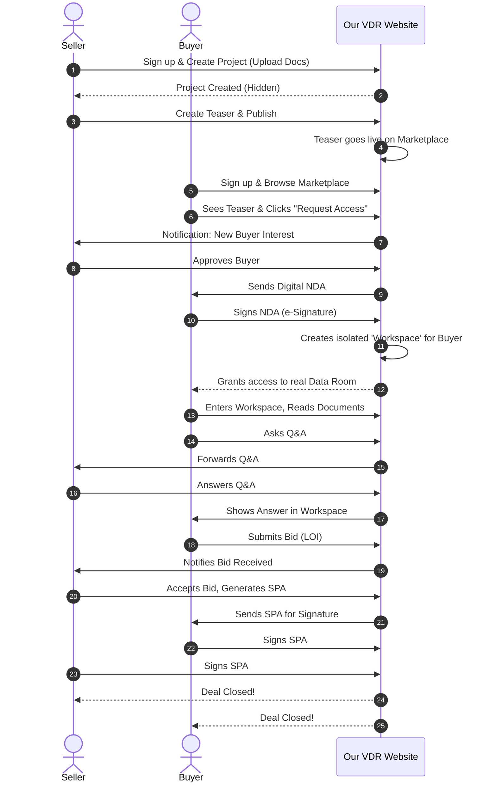

# End-to-End User Journey: M&A Platform (Website Flow)

This document explains step-by-step how a Seller and Buyer sign up on our M&A Website and what screens they use to successfully close a Deal.

---

## 1. The Seller's Journey

The Seller (or Investment Banker) visits the website to sell their company.

*   **Step 1: Sign Up & Onboarding**
    *   The Seller comes to our website and clicks the "Sell Your Business" or "List a Deal" button.
    *   They sign up by providing their name and company email.
*   **Step 2: Dashboard & Create Project**
    *   Once logged in, the Seller Dashboard opens for them.
    *   They click the "Create New Project" button.
    *   They enter confidential information such as the real company name, industry, and revenue. (This is completely private and not visible to anyone at this point).
*   **Step 3: Command Center / VDR Setup (Uploading Documents)**
    *   Once the Project is created, the system takes them to the "Data Room Setup" screen.
    *   There, they create Folders like Financials, Legal, HR, and upload all their company's PDF and Excel documents.
*   **Step 4: Create Teaser & Publish (Start Marketing)**
    *   When everything is ready, the Seller creates a "Teaser" (without the company name, e.g., just "A Profitable SaaS Startup").
    *   They click the "Publish to Marketplace" button. Now, this Deal appears on the public marketing page.
*   **Step 5: Manage Buyers & NDA**
    *   If any Buyers view the Teaser and request access, the Seller receives a Notification.
    *   The Seller checks their Profile and clicks "Approve". The system automatically sends an NDA to the Buyer.
*   **Step 6: Workspace Monitoring & Q&A**
    *   Once the Buyer signs the NDA, separate Workspaces (e.g., "Google's Workspace", "Microsoft's Workspace") are created in the Seller's dashboard.
    *   The Seller can enter these Workspaces to answer questions asked by the Buyer (Q&A). They can also monitor which Buyer read which document and for how long (Audit Log).
*   **Step 7: Accept Bid & SPA Closing**
    *   The Seller reviews the Bids submitted by Buyers, selects the best offer, and clicks "Accept Bid".
    *   Finally, they use the "SPA Module" in our VDR to obtain digital signatures and close the deal.

---

## 2. The Buyer's Journey

A Buyer intending to acquire a company visits our website.

*   **Step 1: Sign Up & Explore Marketplace**
    *   The Buyer signs up by clicking "Join as Investor/Buyer".
    *   They are immediately taken to our **"Deal Marketplace"** (Marketing Page). There, they will see Teasers (anonymous advertisements) of various companies as Cards.
*   **Step 2: Request Access & Sign NDA**
    *   If they read a Teaser and are interested, they click the "Request NDA & Access" button on that card.
    *   Once the Seller approves, the Buyer receives an email. They click the link and digitally sign (e-Signature) the NDA directly on our website.
*   **Step 3: My Workspaces (Buyer Dashboard)**
    *   As soon as the NDA is signed, a card for this company appears in a new section called **"My Deals / Workspaces"** in the Buyer's dashboard.
*   **Step 4: Due Diligence (Entering the VDR)**
    *   They click that card and enter their **private Workspace** (VDR Data Room).
    *   Only now is the real name of the company and the CIM (Complete Information Memorandum) revealed to them.
    *   They read all the Documents uploaded by the Seller. If they have a doubt, they right-click on the Document itself and "Ask Question" (Q&A). (This is only visible to the Seller).
*   **Step 5: Submit Bid**
    *   If everything looks good, they click the **"Submit LOI / Bid"** button in their Workspace and confidentially submit an offer saying, "I am buying this company for $10M".
*   **Step 6: Sign SPA (Closing the Deal)**
    *   If the Seller accepts their bid, both receive a "SPA Ready for Signature" notification. They sign and close the Deal.

---

## 3. Visual Workflow Diagram (Website Journey)

This diagram shows where the journeys of both parties intersect on the website:

